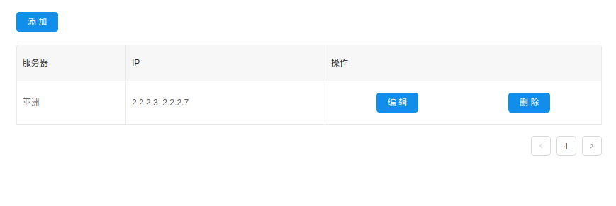
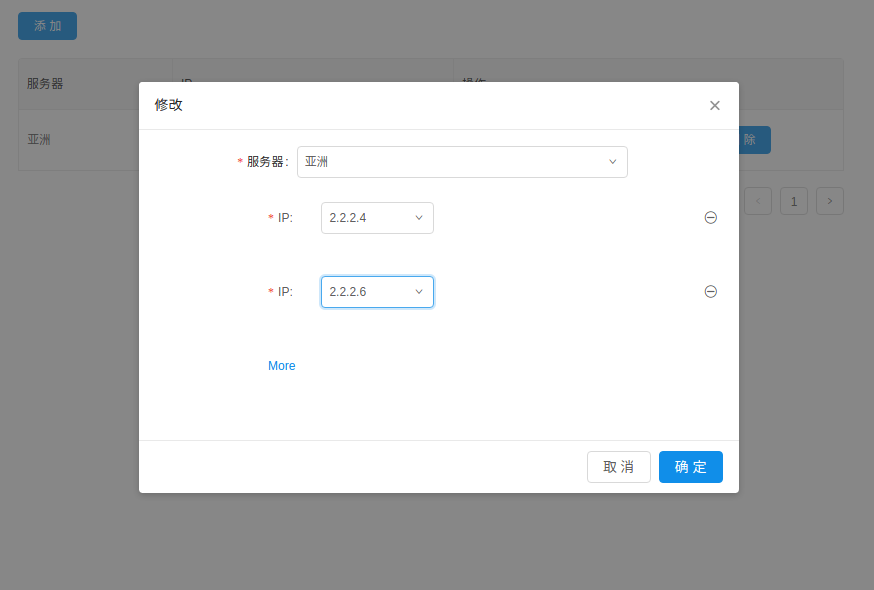

关于实现在阿里的Antd的Modal上实现动态表的一种思路
=============================

# 问题描述
 有一种业务场景，就是我们需要在一个Modal中实现动态添加表单项。并且在该Modal期间会触发状态树的更改，比如你在Modal上填写了一堆数据
 然后点击提交按钮，数据被提交到后台，可是后台发现数据不满足需求，返回了错误信息。此时你希望Modal仍然能显示出来，并且包含已经填写过
 的信息。但是当用户点击新建按钮时候，你又希望这个Modal清空不包含任何信息。

# 目前的解决方案
- [异步请求回来后Modal多次闪现等问题 #916](https://github.com/dvajs/dva/issues/916)
- 上面给出的方案是创建一个新的Modal管理，我尝试了一下没成功，而且代码也变得复杂了。
- 我们想尽可能少的更改代码。于是提出了一个新的思路
# 新建的时候改Key,编辑的时候不改Key
阿里给的参考例子中Modal在Layout中都是通过函数加载的如

```javascript
  cosnt ModalGen = ()=>(<Modal {...ModalProps}/>)
  return (
  ... 
  <ModalGen/>
  ...
  
  )
```

这种方法会造成每次状态树变化时候，Modal重新生成，然后Modal中用户输入的信息如果没有存入状态树，就会丢失。如果用户边输入边存入状态树，
就会造成Modal闪烁

那如何避免每次状态树变化时候，Modal不重新生成呢，就不用函数的方式

```javascript
  return(
  ...
   <Modal {...ModalProps}/>
   ...
  
  )
```


这样就可以避免状态树变化时候的重新生成啦，但是当用户点击新建之类的按钮，并不希望看到Modal中存在以前填写的信息，怎么办呢你。
其实很简单，我们添加一个Key的属性就行啦。当用户新建时候，修改这个key,其他情况保持key不变。

```javascript
  return(
  ...
   <Modal  key={modalKey} {...ModalProps}/>
   ...
  
  )
```


# 样列场景
- 提供一个服务器集群白名单防火墙功能，用户可以通过该界面配置允许的IP的地址。
- 那么首先提供一个可以浏览白名单的列表。上方一个添加按钮，并且每个服务器的IP白名单可以编辑。
- 无论点击编辑还是新建弹出一个Modal，里面可以选择服务器,
- 当你选择好服务器之后，在Modal不消失的情况下，选择可用的IP列表供用户选择。

# 运行
 ```
 npm install
 npm start
 ```
浏览器访问 [localhost:8000/#/ip](http://localhost:8000/#/ip)

# 截图





# 源代码地址
[kyle的github](https://github.com/nianhua110/dynamic-form-on-modal)
